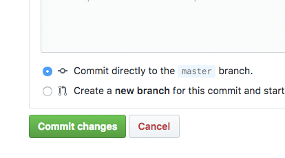

# komenoma-syokutaku

「こめのまのある食卓」特設ページ

http://syokutaku.komenoma.com

## instagram 掲載写真の更新手順

① docs をクリック

② instagram.txt をクリック

③ 右側の鉛筆アイコン（Edit this file）をクリック

④ インスタの投稿IDを改行で区切って入力（上から順に表示されます）

⑤ ページ下部の「Commit changes」をクリックして完了。

